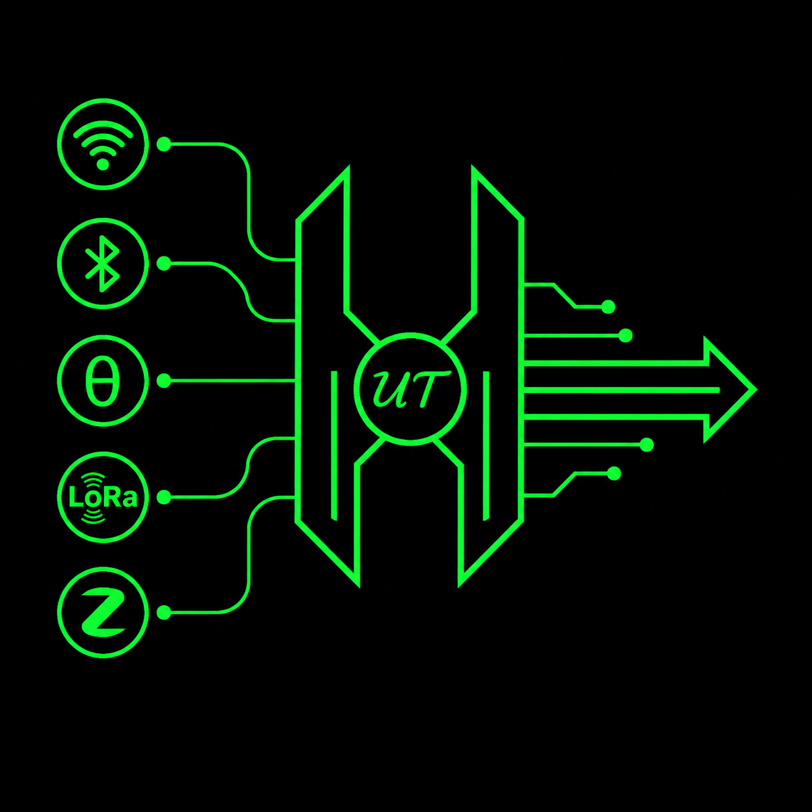
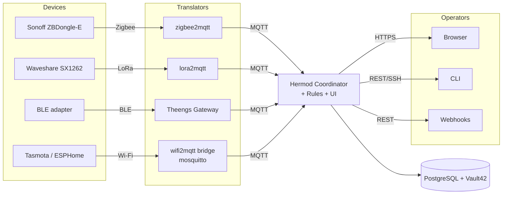

<h1>
  
  &nbsp;Hermod
</h1>

Hermod is a unified IoT translator that bridges Zigbee, LoRa, BLE, and Wi-Fi devices into a single MQTT mesh, with a rules engine, a Blazor dashboard, and JWT-authenticated REST APIs. It is designed to run on a single Raspberry Pi 5 with hardened mTLS between every internal service, and falls back to a single-host docker-compose stack for laptop development.



## Get started

The recommended path is the bundled text user interface:

```bash
./hermod.sh        # Linux/macOS/WSL2 — drops into the interactive UI
hermod.bat         # Windows — compose-only entry point
```

The UI walks an operator through the eight sections (Compose, Provisioning, Production, Secrets, Users, Network/TLS, Settings, Diagnostics). Every action it offers is a thin wrapper on a `hermod.sh` subcommand, so anything you can click you can also script.

For a quick local preview without touching a Raspberry Pi:

```bash
./hermod.sh compose up
# Coordinator dashboard: http://localhost:42069
# Default seed credentials are printed at the bottom of the run.
```

For a real production deployment to a Raspberry Pi 5 (microk8s + mTLS + optional public TLS), see [INSTALL.md → Path 2](INSTALL.md#path-2--raspberry-pi-production-hermodsh) and the operator reference at [docs/HERMOD_SH.md](docs/HERMOD_SH.md).

## Where to read next

| You want to | Read |
|---|---|
| Try Hermod on your laptop | [INSTALL.md](INSTALL.md) → Path 1 (docker-compose) |
| Deploy to a Raspberry Pi 5 | [INSTALL.md](INSTALL.md) → Path 2 |
| Reference for every CLI subcommand, target, overlay | [docs/HERMOD_SH.md](docs/HERMOD_SH.md) |
| Security model, threat analysis, edge-TLS options | [SECURITY.md](SECURITY.md) |

## Repository layout

```
hermod.sh                Linux/macOS/WSL2 CLI entry point (also launches the TUI)
hermod.bat               Windows CLI entry point — local docker-compose only
docker-compose.yaml      preview stack (Coordinator + translators + mock devices)
hermod-prod.env.example  operator-vault template; copy to hermod-prod.env locally
lib/                     hermod.sh-owned helpers (TUI, mimir vault, certs, pi-installer, compose)
ansible/                 Pi provisioning playbooks (driven via hermod.sh provision)
kubernetes/              base manifests + prod overlays + edge-TLS overlay family
src/                     .NET source for Coordinator + LoRa2MQTT
tests/                   unit + integration tests (xUnit)
docs/                    operator reference
INSTALL.md               install paths (compose for laptop, microk8s for Pi)
SECURITY.md              security model
README.md                you are here
```

## License

Released under the MIT License — see [`LICENSE`](LICENSE).
